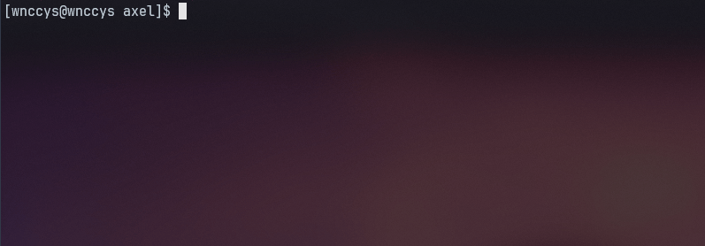

# `axel`

axel is a experimental daemonless container management tool which has it's own hand-crafted container runtime, *woody* which works like 'runc'.

    

 

The project's main goal is to learn what really containers are, how they are made and how they work, as well as to develop something valuable on the path;
It is very lightweight and runs on a simple spawned process which does not require a daemon in order to run, looks much more like a youki/Podman than a Docker.
And the best: it is rootless; What greatly reduces the surface of security attacks.

Unlike Podman it doesn't depends as a daemon like conmon or dockerd like Docker, containers are managed entirelly using woody and axel as it's front-end.

## How to use

## Commands

## Shades

## Roadmap

- [x] Rootless API architecture
- [x] Stop/run/list/delete containers
- [ ] YAML batch config/action support
- [x] Custom PTY Handling
- [x] Interactive shell mode (-it) / Detach mode (-d)
- [ ] Graceful PTY shutdown
- [x] Docker registry complete compatibility
- [ ] General registries compatibility
- [ ] OCI-Compliant support
    - [x] Hostname
    - [ ] Resources
    - [x] Process (user, args, env, cwd)
    - [x] Cgroups
    - [ ] Capabilities
    - [x] Namespaces
    - [x] Masked Paths
    - [x] Read-Only Paths
    - [x] Mounts
    - [ ] Network Isolation
    - [x] UID/GID Maps
- [ ] Container's network internal replication (network fallback)
- [ ] Network custom configuration (slirp4netns?)
- [ ] Network internal bridges
- [ ] PSI usage metrics

## Contributing

## License

MIT
